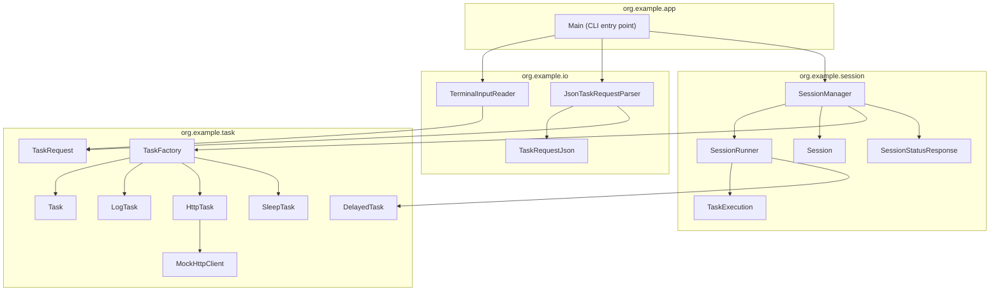
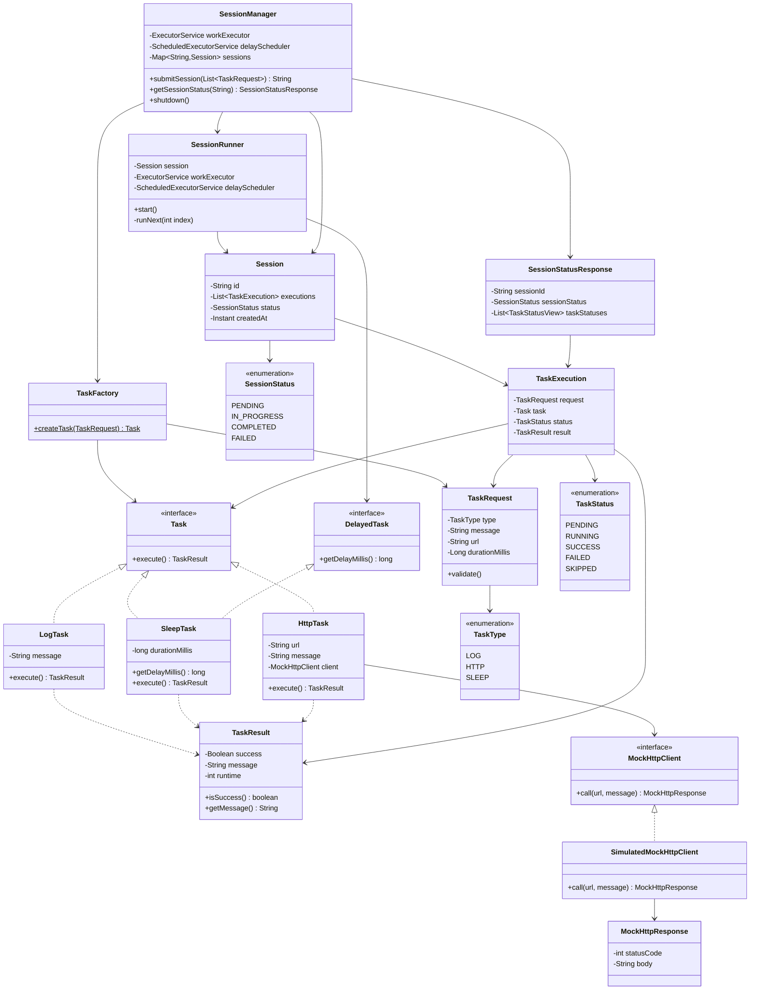
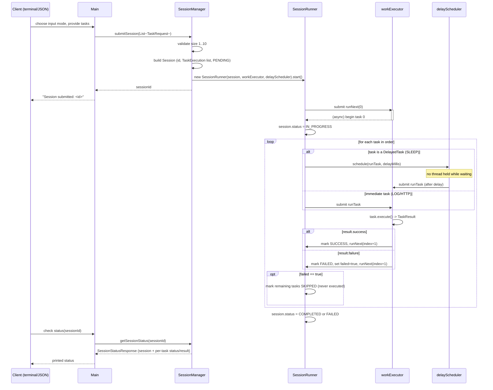
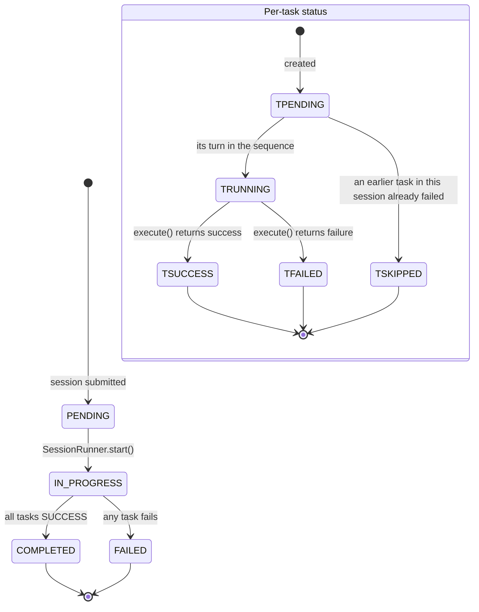

# jiostar — Java Workflow/Task Engine

A single-user, in-process workflow engine. A client submits a batch of 1–10 tasks as a
**session**; sessions run concurrently with each other, tasks within a session run
strictly in submission order, and a session fails fast (without affecting any other
session) if one of its tasks fails.

## Requirements

- JDK 21+ (developed against JDK 25). No local Gradle install needed — use the bundled
  wrapper (`./gradlew`).

## How to run

```bash
./gradlew run
```

This starts an interactive terminal menu:

```
1) Submit session (terminal input)
2) Submit session (JSON input)
3) Check session status
4) Exit
```

- **Option 1** walks you through building 1–10 tasks via prompts (task type, then its
  parameters).
- **Option 2** accepts a pasted JSON array of tasks (see shape below), terminated by a
  blank line.
- **Option 3** prints a session's current status and the status/result of every task in
  it, given a session ID (printed when a session is submitted).
- **Option 4** exits. In-progress/queued sessions are allowed to run to completion first
  (no session can be cancelled once started) — see [Architecture](#architecture).

### JSON task shape

```json
[
  { "type": "LOG", "message": "starting job" },
  { "type": "HTTP", "url": "https://example.com/api", "message": "ping" },
  { "type": "SLEEP", "durationMillis": 500 }
]
```

`HTTP` calls are mocked — no real network I/O is performed. `HttpTask` uses
`SimulatedMockHttpClient`, which returns a simulated `500` if `message` contains the
substring `"fail"` (case-insensitive), else a simulated `200`. This is useful for
exercising the fail-fast path deliberately.

## Build & test

```bash
./gradlew build     # compile + run all tests
./gradlew test       # run tests only
./gradlew compileJava # compile main sources only
```

Test reports land in `build/reports/tests/test/index.html`; JUnit XML in
`build/test-results/test/`.

## Deployment

This is a CLI/library, not a server — "deployment" means producing a runnable artifact
and executing it wherever it's needed. The `application` Gradle plugin (already
configured in `build.gradle`, `mainClass = 'org.example.app.Main'`) builds this for you
with no extra plugins:

```bash
# Produce an installable distribution (start scripts + all dependency jars, incl. gson)
./gradlew installDist
./build/install/jiostar/bin/jiostar

# Or produce a shippable zip/tar to copy to another machine
./gradlew distZip     # -> build/distributions/jiostar-1.0-SNAPSHOT.zip
./gradlew distTar
```

Unzip/untar the distribution on the target machine (any machine with a JDK 21+ runtime)
and run `bin/jiostar` (or `bin/jiostar.bat` on Windows) — no separate JRE bundling or
containerization is required for this project's scope (single user, in-memory state).

## Build pipeline (CI)

A GitHub Actions workflow is included at
[`.github/workflows/build.yml`](.github/workflows/build.yml). It runs `./gradlew build`
(compile + full test suite) on every push and pull request targeting `main`, using the
Gradle wrapper so the CI Gradle version always matches what's committed. Once this
project is pushed to a GitHub remote, the workflow runs automatically — no further setup
needed. To extend it (e.g. add the `distZip` artifact as a build output, add a release
job), edit that file directly.

## Architecture

Four packages, each with a single responsibility:

- **`org.example.task`** — the 3 task types (`LogTask`, `HttpTask`, `SleepTask`), the
  `Task`/`DelayedTask`/`TaskResult` contracts, and `TaskFactory`/`TaskRequest` for
  turning client input into a runnable `Task`.
- **`org.example.session`** — the engine: `SessionManager` (submit/query API, owns the
  executors), `SessionRunner` (drives one session's tasks in order, non-blocking),
  `Session`/`TaskExecution` (mutable run state), `SessionStatusResponse` (read DTO).
- **`org.example.io`** — converts terminal prompts or a JSON array into
  `List<TaskRequest>`.
- **`org.example.app`** — `Main`, the CLI entry point / menu loop.



### Why sleeping tasks don't block a worker thread

`SessionManager` owns two executors: a bounded `workExecutor` (fixed thread pool — where
task work actually runs) and a single-threaded `delayScheduler` (a pure timer — it only
fires a callback after a delay and holds no thread while waiting). A `SleepTask`
declares its wait via `getDelayMillis()` instead of calling `Thread.sleep()`.
`SessionRunner` realizes that wait on `delayScheduler` and only hands the task back to
`workExecutor` once the delay has elapsed — so a long sleep in one session never starves
other sessions of worker threads, even with a pool of size 1.

## Class diagram



## Flow: submitting a session and checking its status



## Task/session status lifecycle


